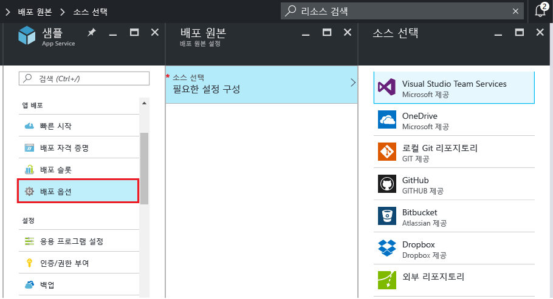
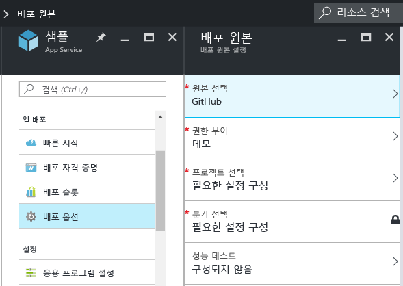
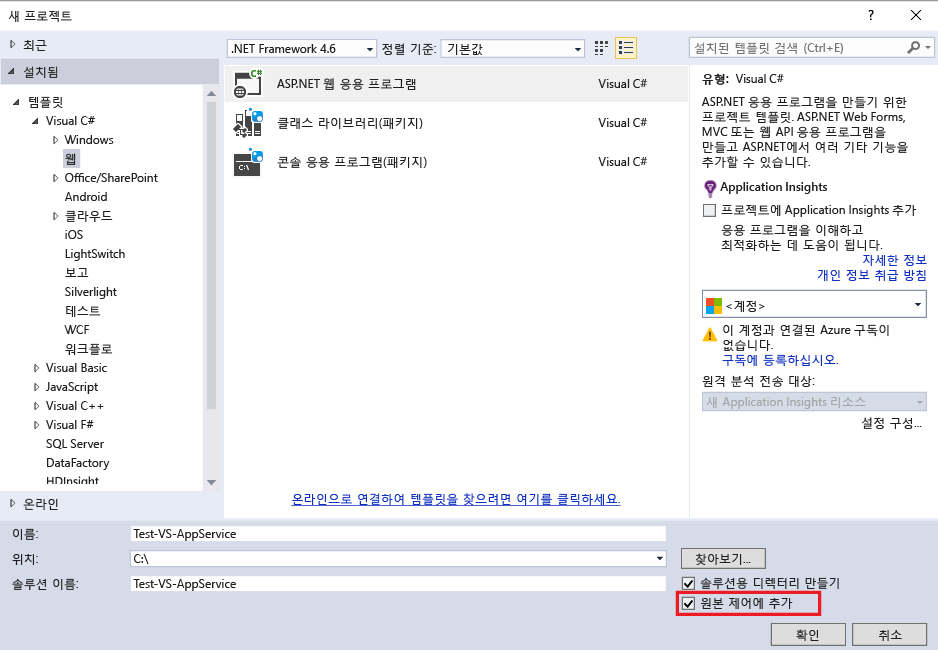
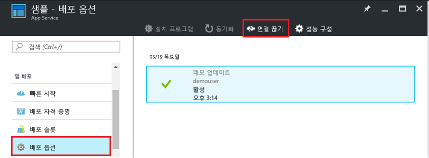

# Azure 앱 서비스에 연속 배포
이 자습서에서는 [Azure Web Apps](app-service-web-overview.md)에 대한 연속 배포 워크플로를 구성하는 방법을 보여 줍니다. BitBucket, GitHub 및 [VSTS(Visual Studio Team Services)](https://www.visualstudio.com/team-services/)와 App Service 통합을 통해 Azure가 이러한 서비스 중 하나에 게시한 프로젝트에서 최신 업데이트를 가져오는 연속 배포 워크플로를 활성화합니다. 연속 배포는 여러 개의 빈번한 작성자가 통합되는 프로젝트에 적합한 옵션입니다.

Azure Portal에 의해 나열되지 않은 클라우드 저장소에서 수동으로 연속 배포를 구성하는 방법을 확인하려면(예: [GitLab](https://gitlab.com/)), [수동 단계를 사용하여 연속 배포 설정](https://github.com/projectkudu/kudu/wiki/Continuous-deployment#setting-up-continuous-deployment-using-manual-steps)을 참조하세요.

## 연속 배포 활성화
연속 배포를 활성화하려면

1. 연속 배포에 사용될 리포지토리에 앱 콘텐츠를 게시합니다.  
    이러한 서비스에 프로젝트를 게시하는 것에 대한 자세한 내용은 [리포지토리 만들기(GitHub)], [리포지토리 만들기(BitBucket)] 및 [VSTS 시작]을 참조하세요.
2. 앱의 메뉴 블레이드에 있는 [Azure 포털]에서 **앱 배포 > 배포 옵션**을 클릭합니다. **원본 선택**을 클릭한 다음 배포 원본을 선택합니다.  
   
    
   
   > [!NOTE]
   > 앱 서비스 배포를 위한 VSTS 계정을 구성하려면 이 [자습서](https://github.com/projectkudu/kudu/wiki/Setting-up-a-VSTS-account-so-it-can-deploy-to-a-Web-App)를 참조하세요.
   > 
   > 
3. 권한 부여 워크플로를 완료합니다.
4. **배포 원본** 블레이드에서 배포할 프로젝트 및 분기를 선택합니다. 완료되면 **확인**을 클릭합니다.
   
    
   
   > [!NOTE]
   > GitHub 또는 BitBucket에서 지속적으로 배포할 수 있도록 하면 공용 및 개인 프로젝트가 둘 다 표시됩니다.
   > 
   > 
   
    앱 서비스는 선택한 저장소와의 연결을 만들고 지정한 분기에서 파일을 가져오고 앱 서비스 앱에 대한 리포지토리의 복제본을 유지합니다. Azure 포털에서 VSTS 연속 배포를 구성할 때 통합은 App Service [Kudu 배포 엔진](https://github.com/projectkudu/kudu/wiki)을 사용하며 여기서는 모든 `git push`를 통해 빌드 및 배포 작업을 자동화합니다. VSTS에서 연속 배포를 별도로 설정할 필요가 없습니다. 이 프로세스를 완료한 후에는 **배포 옵션** 앱 블레이드에서 배포가 성공했음을 나타내는 활성 배포를 표시합니다.
5. 앱이 성공적으로 배포되었는지 확인하려면 Azure 포털에서 앱의 블레이드 맨 위에 있는 **URL**을 클릭합니다.
6. 사용자가 선택한 리포지토리에서 지속적으로 배포되는지 확인하려면, 리포지토리에 대한 변경을 푸시합니다. 리포지토리에 푸시한 직후 변경 내용이 반영되도록 앱을 업데이트해야 합니다. 앱의 **배포 옵션** 블레이드에서 업데이트를 가져왔는지 확인할 수 있습니다.

## Visual Studio 솔루션의 연속 배포
Azure 앱 서비스에 Visual Studio 솔루션을 푸시하는 것은 간단한 index.html 파일을 푸시하는 것만큼 쉽습니다. 앱 서비스 배포 프로세스는 NuGet 종속성 복원 및 응용 프로그램 이진 파일 생성 등의 모든 세부 정보를 간소화합니다. Git 리포지토리에서 코드를 유지 관리하는 소스 제어 모범 사례만 따르면 나머지는 앱 서비스 배포에서 처리할 수 있습니다.

솔루션과 리포지토리를 다음과 같이 구성한 경우 Visual Studio 솔루션을 앱 서비스에 푸시하는 단계는 [이전 섹션](#overview)과 동일합니다.

* Visual Studio 원본 제어 옵션을 사용하여 아래 이미지와 같은 `.gitignore` 파일을 생성하거나 이 [.gitignore 샘플](https://github.com/github/gitignore/blob/master/VisualStudio.gitignore)과 유사한 콘텐츠로 리포지토리 루트에 `.gitignore` 파일을 수동으로 추가합니다.
  
  
* 전체 솔루션의 디렉터리 트리를 리포지토리에 추가하고 .sln 파일을 리포지토리 루트에 둡니다.

설명된 대로 리포지토리를 설정하고, 온라인 Git 리포지토리 중 하나에서 연속 게시에 대해 Azure에서 앱을 구성한 후에는 Visual Studio에서 ASP.NET 응용 프로그램을 로컬로 개발하고 온라인 Git 리포지토리에 변경 내용을 푸시하여 코드를 지속적으로 배포할 수 있습니다.

## 지속적 배포 사용 안 함
지속적 배포를 비활성화하려면

1. 앱의 메뉴 블레이드에 있는 [Azure 포털]에서 **앱 배포 > 배포 옵션**을 클릭합니다. 그런 다음 **배포 옵션** 블레이드에서 **연결 끊기**를 클릭합니다.
   
    
2. 확인 메시지에서 **예**를 클릭한 후 다른 원본의 게시를 설정하려면 앱의 블레이드로 돌아가서 **앱 배포 > 배포 원본**을 클릭합니다.

## 추가 리소스
* [연속 배포의 일반 문제를 조사하는 방법](https://github.com/projectkudu/kudu/wiki/Investigating-continuous-deployment)
* [Azure용 PowerShell 사용 방법]
* [Mac 및 Linux용 Azure 명령줄 도구를 사용하는 방법]
* [Git 설명서]
* [Project Kudu](https://github.com/projectkudu/kudu/wiki)
* [Use Azure to automatically generate a CI/CD pipeline to deploy an ASP.NET 4 app](https://www.visualstudio.com/docs/build/get-started/aspnet-4-ci-cd-azure-automatic)(Azure를 사용하여 ASP.NET 4 앱을 배포할 CI/CD 파이프라인을 자동으로 생성)

> [!NOTE]
> Azure 계정을 등록하기 전에 Azure App Service를 시작하려면 [App Service 체험](https://azure.microsoft.com/try/app-service/)으로 이동합니다. App Service에서 단기 스타터 웹앱을 즉시 만들 수 있습니다. 신용 카드는 필요하지 않으며 약정도 필요하지 않습니다.
> 
> 

[Azure 포털]: https://portal.azure.com
[VSTS Portal]: https://www.visualstudio.com/en-us/products/visual-studio-team-services-vs.aspx
[Installing Git]: http://git-scm.com/book/en/Getting-Started-Installing-Git
[Azure용 PowerShell 사용 방법]: /powershell/azureps-cmdlets-docs
[Mac 및 Linux용 Azure 명령줄 도구를 사용하는 방법]:../cli-install-nodejs.md
[Git 설명서]: http://git-scm.com/documentation

[리포지토리 만들기(GitHub)]: https://help.github.com/articles/create-a-repo
[리포지토리 만들기(BitBucket)]: https://confluence.atlassian.com/display/BITBUCKET/Create+an+Account+and+a+Git+Repo
[VSTS 시작]: https://www.visualstudio.com/docs/vsts-tfs-overview
