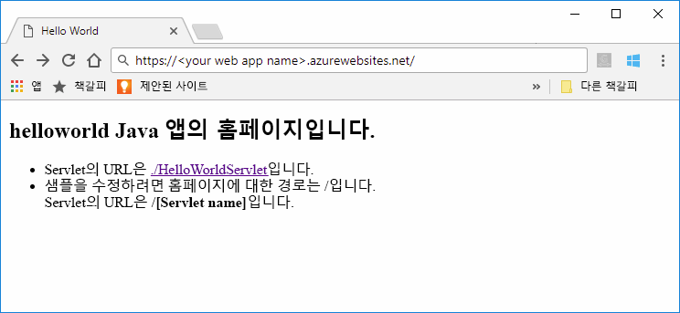
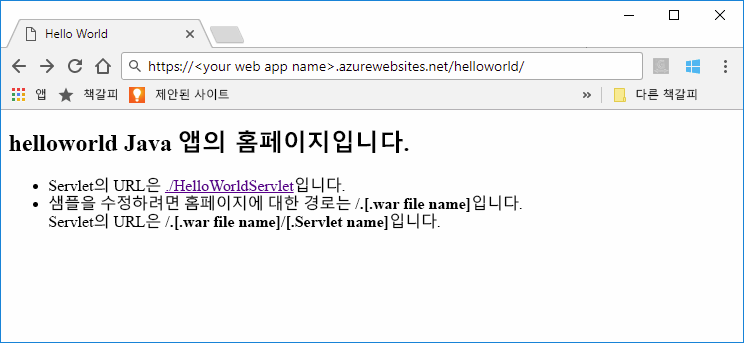

# <a name="quickstart-create-a-java-web-app-in-app-service-on-linux"></a>빠른 시작: Linux의 App Service에서 Java 웹앱 만들기

Linux의 App Service는 현재 Java 웹앱을 지원하기 위한 미리 보기 기능을 제공합니다. 미리 보기에 대한 자세한 내용은 [Microsoft Azure 미리 보기에 대한 추가 사용 약관](https://azure.microsoft.com/support/legal/preview-supplemental-terms/)을 참조하세요. 

[Linux의 App Service](app-service-linux-intro.md)는 Linux 운영 체제를 사용하여 확장성이 높은 자체 패치 웹 호스팅 서비스를 제공합니다. 이 빠른 시작에서는 [Azure Web Apps용 Maven 플러그인(미리 보기)](https://github.com/Microsoft/azure-maven-plugins/tree/develop/azure-webapp-maven-plugin)과 함께 [Azure CLI](https://docs.microsoft.com/cli/azure/get-started-with-azure-cli)를 사용하여 Linux 이미지가 내장된 Java 웹앱을 배포하는 방법을 보여 줍니다.



[IntelliJ용 Azure 도구 키트를 사용하여 클라우드에서 Linux 컨테이너에 Java 웹앱 배포](https://docs.microsoft.com/java/azure/intellij/azure-toolkit-for-intellij-hello-world-web-app-linux)는 고유한 컨테이너에 Java 앱을 배포하는 대체 방법입니다.

[!INCLUDE [quickstarts-free-trial-note](../../../includes/quickstarts-free-trial-note.md)]


## <a name="prerequisites"></a>필수 조건

이 빠른 시작을 완료하려면 다음이 필요합니다. 

* 로컬에 설치된 [Azure CLI 2.0 이상 버전](https://docs.microsoft.com/cli/azure/install-azure-cli?view=azure-cli-latest).
* [Apache Maven](http://maven.apache.org/).


## <a name="create-a-java-app"></a>Java 앱 만들기

Maven을 사용하여 다음 명령을 실행하여 새 *helloworld* 웹앱을 만듭니다.  

    mvn archetype:generate -DgroupId=example.demo -DartifactId=helloworld -DarchetypeArtifactId=maven-archetype-webapp

새 *helloworld* 프로젝트 디렉터리로 변경하고 다음 명령을 사용하여 모든 모듈을 빌드합니다.

    mvn verify

이 명령은 *helloworld/target* 하위 디렉터리의 *helloworld.war* 파일을 포함한 모든 모듈을 확인하고 생성합니다.


## <a name="deploying-the-java-app-to-app-service-on-linux"></a>Linux의 App Service에 Java 앱 배포

Linux에서 Java 웹앱을 App Service에 배포하기 위한 여러 가지 배포 옵션이 있습니다. 이러한 옵션에는 다음이 포함됩니다.

* [Azure Web Apps용 Maven 플러그인을 통한 배포](https://github.com/Microsoft/azure-maven-plugins/tree/develop/azure-webapp-maven-plugin)
* [ZIP 또는 WAR을 통한 배포](https://docs.microsoft.com/azure/app-service/app-service-deploy-zip)
* [FTP를 통한 배포](https://docs.microsoft.com/azure/app-service/app-service-deploy-ftp)

이 빠른 시작에서는 Azure 웹앱용 Maven 플러그인을 사용합니다. Maven에서 사용하기 쉽고, 필요한 Azure 리소스(리소스 그룹, 앱 서비스 계획 및 웹앱)가 자동으로 생성된다는 이점이 있습니다.

### <a name="deploy-with-maven"></a>Maven을 사용하여 배포

Maven에서 배포하려면 *pom.xml* 파일의 `<build>` 요소 내에 다음 플러그 인 정의를 추가합니다.

```xml
    <plugins>
      <plugin>
        <groupId>com.microsoft.azure</groupId> 
        <artifactId>azure-webapp-maven-plugin</artifactId> 
        <version>1.1.0</version>
        <configuration> 
          <resourceGroup>YOUR_RESOURCE_GROUP</resourceGroup> 
          <appName>YOUR_WEB_APP</appName> 
          <linuxRuntime>tomcat 9.0-jre8</linuxRuntime>
          <deploymentType>ftp</deploymentType> 
          <resources> 
              <resource> 
                  <directory>${project.basedir}/target</directory> 
                  <targetPath>webapps</targetPath> 
                  <includes> 
                      <include>*.war</include> 
                  </includes> 
                  <excludes> 
                      <exclude>*.xml</exclude> 
                  </excludes> 
              </resource> 
          </resources> 
        </configuration>
      </plugin>
    </plugins>
```    

플러그인 구성에서 다음 자리 표시자를 업데이트합니다.

| Placeholder | 설명 |
| ----------- | ----------- |
| `YOUR_RESOURCE_GROUP` | 웹앱을 만들 새 리소스 그룹의 이름입니다. 앱의 모든 리소스를 한 그룹에 배치하여 다 함께 관리할 수 있습니다. 예를 들어 리소스 그룹을 삭제하면 앱과 연결된 모든 리소스가 삭제됩니다. 이 값을 고유한 새 리소스 그룹(예: *TestResources*)으로 업데이트합니다. 이 리소스 그룹 이름을 사용하여 이후 섹션에서 모든 Azure 리소스를 정리합니다. |
| `YOUR_WEB_APP` | 앱 이름은 Azure(YOUR_WEB_APP.azurewebsites.net)에 배포할 때 웹앱의 호스트 이름의 일부가 됩니다. 이 값을 Java 앱을 호스팅할 새 Azure 웹앱의 고유 이름(예: *contoso*)으로 업데이트합니다. |

구성의 `linuxRuntime` 요소는 응용 프로그램과 함께 사용되는 기본 제공 Linux 이미지를 제어합니다.

다음 명령을 실행하고 모든 지시에 따라 Azure CLI로 인증합니다.

    az login

다음 명령을 사용하여 Java 앱을 웹앱에 배포합니다.

    mvn clean package azure-webapp:deploy


배포가 완료되면 웹 브라우저에서 다음 URL을 사용하여 배포된 응용 프로그램으로 이동합니다.

```bash
http://<app_name>.azurewebsites.net/helloworld
```

Java 샘플 코드가 기본 제공 이미지가 있는 웹앱에서 실행됩니다.



**축하합니다.** Linux의 App Service에 첫 번째 Java 앱을 배포했습니다.


[!INCLUDE [cli-samples-clean-up](../../../includes/cli-samples-clean-up.md)]


## <a name="next-steps"></a>다음 단계

이 빠른 시작에서는 Maven을 사용하여 Java 웹앱을 만든 다음, Linux의 App Service에 Java 웹앱을 배포했습니다. Azure와 함께 Java를 사용하는 방법에 대해 자세히 알아보려면 아래 링크로 이동하세요.

> [!div class="nextstepaction"]
> [Java 개발자용 Azure](https://docs.microsoft.com/java/azure/)

