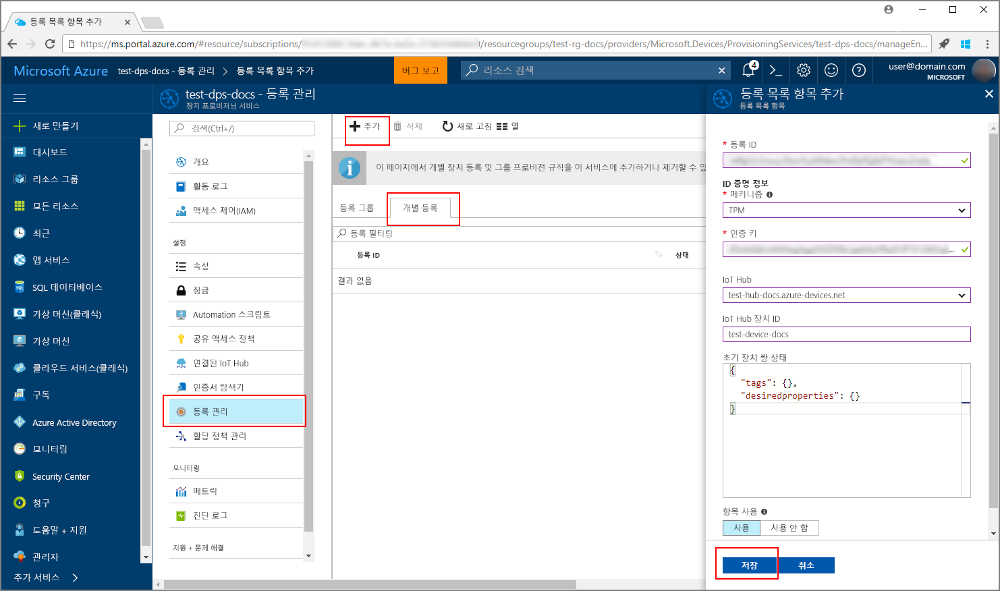

# <a name="create-and-provision-a-simulated-tpm-device-using-c-device-sdk-for-iot-hub-device-provisioning-service"></a>IoT Hub Device Provisioning Service용 C 장치 SDK를 사용하여 시뮬레이션된 TPM 장치 만들기 및 프로비전

[!INCLUDE [iot-dps-selector-quick-create-simulated-device-tpm](../../includes/iot-dps-selector-quick-create-simulated-device-tpm.md)]

다음 단계에서는 Windows OS를 실행 중인 개발 컴퓨터에서 시뮬레이션된 장치를 만들고 Windows TPM 시뮬레이터를 장치의 [HSM(하드웨어 보안 모듈)](https://azure.microsoft.com/blog/azure-iot-supports-new-security-hardware-to-strengthen-iot-security/)으로 실행하며 코드 샘플을 사용하여 시뮬레이션된 장치를 Device Provisioning Service 및 IoT Hub와 연결하는 방법을 보여 줍니다. 

자동 프로비전 프로세스에 익숙하지 않은 경우 [자동 프로비전 개념](concepts-auto-provisioning.md)도 검토하세요. 계속하기 전에 [Azure Portal에서 IoT Hub Device Provisioning Service 설정](./quick-setup-auto-provision.md)의 단계를 완료해야 합니다. 

[!INCLUDE [IoT DPS basic](../../includes/iot-dps-basic.md)]

<a id="setupdevbox"></a>

## <a name="prepare-the-development-environment"></a>개발 환경 준비 

1. 컴퓨터에 Visual Studio 2015 또는 [Visual Studio 2017](https://www.visualstudio.com/vs/)이 설치되어 있는지 확인합니다. Visual Studio 설치에서 ['C++를 사용한 데스크톱 개발'](https://www.visualstudio.com/vs/support/selecting-workloads-visual-studio-2017/) 워크로드를 사용하도록 설정해야 합니다.

2. [CMake 빌드 시스템](https://cmake.org/download/)을 다운로드하여 설치합니다. `cmake`를 설치하기 **전에** 'C++를 사용한 데스크톱 개발' 워크로드가 있는 Visual Studio를 컴퓨터에 설치해야 합니다.

3. 컴퓨터에 `git`이 설치되어 있고 명령 창에서 액세스할 수 있는 환경 변수에 추가되었는지 확인합니다. 설치할 `git` 도구의 최신 버전은 [Software Freedom Conservancy의 Git 클라이언트 도구](https://git-scm.com/download/)를 참조하세요. 여기에는 로컬 Git 리포지토리와 상호 작용하는 데 사용할 수 있는 명령줄 앱인 **Git Bash**가 포함됩니다. 

4. 명령 프롬프트 또는 Git Bash를 엽니다. 장치 시뮬레이션 샘플 코드에 대한 GitHub 리포지토리를 복제합니다.
    
    ```cmd/sh
    git clone https://github.com/Azure/azure-iot-sdk-c.git --recursive
    ```

5. CMake 빌드 프로세스에 대한 이 GitHub 리포지토리의 로컬 복사본에 폴더를 만듭니다. 

    ```cmd/sh
    cd azure-iot-sdk-c
    mkdir cmake
    cd cmake
    ```

6. 이 코드 샘플에서는 Windows TPM 시뮬레이터를 사용하여 SAS 토큰 인증을 통해 증명을 제공합니다. 다음 명령을 실행하여 개발 클라이언트 플랫폼 및 [증명 메커니즘](concepts-security.md#attestation-mechanism)(TPM 시뮬레이터)과 관련된 SDK 버전을 빌드합니다. 또한 시뮬레이션된 장치에 대해 Visual Studio 솔루션을 생성합니다.

    ```cmd/sh
    cmake -Duse_prov_client:BOOL=ON -Duse_tpm_simulator:BOOL=ON ..
    ```

    `cmake`에서 C++ 컴파일러를 찾지 못하면 위의 명령을 실행하는 동안 빌드 오류가 발생할 수 있습니다. 이 경우에는 [Visual Studio 명령 프롬프트](https://docs.microsoft.com/dotnet/framework/tools/developer-command-prompt-for-vs)에서 이 명령을 실행합니다. 

7. 별도의 명령 프롬프트에서 GitHub 루트 폴더로 이동하고 [TPM](https://docs.microsoft.com/windows/device-security/tpm/trusted-platform-module-overview) 시뮬레이터를 실행합니다. 포트 2321 및 2322에서 소켓을 수신 대기합니다. 이 명령 창을 닫지 마세요. 이 빠른 시작 가이드가 끝날 때까지 이 시뮬레이터가 실행되는 상태를 유지해야 합니다. 

   *cmake* 폴더에 있으면 다음 명령을 실행합니다.

    ```cmd/sh
    cd..
    .\provisioning_client\deps\utpm\tools\tpm_simulator\Simulator.exe
    ```

<a id="simulatetpm"></a>

## <a name="simulate-tpm-device"></a>TPM 장치 시뮬레이션

1. *cmake* 폴더에 생성된 `azure_iot_sdks.sln`이라는 솔루션을 열고 Visual Studio에서 빌드합니다.

2. Visual Studio의 *솔루션 탐색기* 창에서 **Provision\_Tools** 폴더로 이동합니다. **tpm_device_provision** 프로젝트를 마우스 오른쪽 단추로 클릭한 다음 **시작 프로젝트로 설정**을 선택합니다. 

3. 솔루션을 실행합니다. 장치 등록에 필요한 **_등록 ID_** 와 **_인증 키_** 가 출력 창에 표시됩니다. 이러한 값을 기록해 둡니다. 


<a id="portalenrollment"></a>

## <a name="create-a-device-enrollment-entry-in-the-portal"></a>포털에서 장치 등록 항목 만들기

1. Azure Portal에 로그인하고, 왼쪽 메뉴에서 **모든 리소스** 단추를 클릭하고, Device Provisioning Service를 엽니다.

2. Device Provisioning Service 요약 블레이드에서 **등록 관리**를 선택합니다. **개별 등록** 탭을 선택하고 맨 위에서 **추가** 단추를 클릭합니다. 

3. **등록 목록 항목 추가** 아래에 다음 정보를 입력합니다.
    - ID 증명 *메커니즘*으로 **TPM**을 선택합니다.
    - TPM 장치에 대한 *등록 ID* 및 *인증 키*를 입력합니다.
    - 필요에 따라 다음 정보를 입력합니다.
        - 프로비전 서비스와 연결된 IoT Hub를 선택합니다.
        - 고유한 장치 ID를 입력합니다. 장치 이름을 지정할 때 중요한 데이터가 포함되지 않도록 합니다.
        - 장치에 대해 원하는 초기 구성으로 **초기 장치 쌍 상태**를 업데이트합니다.
    - 완료되면 **저장** 단추를 클릭합니다. 

      

   등록에 성공하면 장치의 *등록 ID*가 *개별 등록* 탭 아래 목록에 나타납니다. 


<a id="firstbootsequence"></a>

## <a name="simulate-first-boot-sequence-for-the-device"></a>장치에 대한 첫 번째 부팅 시퀀스 시뮬레이션

1. Azure Portal에서 Device Provisioning 서비스에 대한 **개요** 블레이드를 선택하고 **_ID 범위_** 값을 기록해 둡니다.

     

2. 컴퓨터의 Visual Studio *솔루션 탐색기*에서 **Provision\_Samples** 폴더로 이동합니다. **prov\_dev\_client\_sample**이라는 샘플 프로젝트를 선택하고, **prov\_dev\_client\_sample.c** 파일을 엽니다.

3. _ID 범위_ 값을 `id_scope` 변수에 할당합니다. 

    ```c
    static const char* id_scope = "[ID Scope]";
    ```

4. 동일한 파일의 **main()** 함수에서 **SECURE_DEVICE_TYPE**이 TPM으로 설정되어 있는지 확인합니다.

    ```c
    SECURE_DEVICE_TYPE hsm_type;
    hsm_type = SECURE_DEVICE_TYPE_TPM;
    ```

   기본적으로 존재하는 `hsm_type = SECURE_DEVICE_TYPE_X509;` 문을 주석 처리하거나 삭제합니다. 

5. **prov\_dev\_client\_sample** 프로젝트를 마우스 오른쪽 단추로 클릭하고 **시작 프로젝트로 설정**을 선택합니다. 솔루션을 실행합니다. 

6. 장치를 부팅하고 IoT Hub 정보를 얻기 위해 Device Provisioning Service에 연결하는 과정을 시뮬레이션하는 메시지를 확인합니다. 프로비전 서비스와 연결된 IoT Hub에 시뮬레이션된 장치를 성공적으로 프로비전하면 장치 ID가 허브의 **IoT 장치** 블레이드에 표시됩니다. 

     

    장치에 대한 등록 항목의 기본값으로부터 *초기 장치 쌍 상태*를 변경한 경우, 허브에서 원하는 쌍 상태를 가져와서 그에 맞게 작동할 수 있습니다. 자세한 내용은 [IoT Hub의 장치 쌍 이해 및 사용](../iot-hub/iot-hub-devguide-device-twins.md)을 참조하세요.


## <a name="clean-up-resources"></a>리소스 정리

장치 클라이언트 샘플을 계속해서 작업하고 탐색할 계획인 경우 이 빠른 시작에서 만든 리소스를 정리하지 마세요. 계속하지 않으려는 경우 다음 단계를 사용하여 이 빠른 시작에서 만든 모든 리소스를 삭제합니다.

1. 컴퓨터에서 장치 클라이언트 샘플 출력 창을 닫습니다.
1. 컴퓨터에서 TPM 시뮬레이터 창을 닫습니다.
1. Azure Portal의 왼쪽 메뉴에서 **모든 리소스**를 클릭한 다음 사용자의 Device Provisioning Service를 선택합니다. 서비스에 대한 **등록 관리** 블레이드를 연 다음, **개별 등록** 탭을 클릭합니다. 이 빠른 시작에서 등록한 장치의 *등록 ID*를 선택하고, 위쪽의 **삭제** 단추를 클릭합니다. 
1. Azure Portal의 왼쪽 메뉴에서 **모든 리소스**를 클릭한 다음 사용자의 IoT Hub를 선택합니다. 허브에 대한 **IoT 장치** 블레이드를 열고, 이 빠른 시작에서 등록한 장치의 *장치 ID*를 선택한 다음, 위쪽의 **삭제** 단추를 클릭합니다.

## <a name="next-steps"></a>다음 단계

이 빠른 시작에서는 시뮬레이션된 TPM 장치를 컴퓨터에 만들고, IoT Hub Device Provisioning Service를 사용하여 IoT Hub에 이 장치를 프로비전했습니다. 프로그래밍 방식으로 TPM 장치를 등록하는 방법을 알아보려면 프로그래밍 방식으로 TPM 장치를 등록하는 빠른 시작으로 계속 진행하세요. 

> [!div class="nextstepaction"]
> [Azure 빠른 시작 - Azure IoT Hub Device Provisioning Service에 TPM 장치 등록](quick-enroll-device-tpm-java.md)

