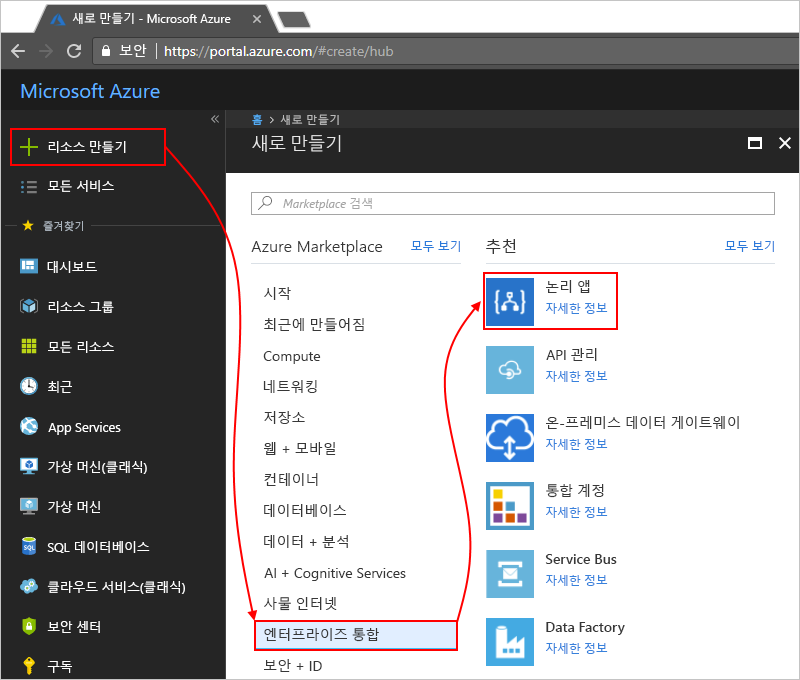

# Log Analytics를 사용한 논리 앱 실행에 관한 모니터링 및 유용한 정보 얻기

모니터링 및 더 다양한 디버깅 정보를 위해 논리 앱을 만들 때 동시에 Log Analytics를 켤 수 있습니다. Log Analytics는 Azure Portal을 통해 논리 앱 실행에 대한 진단 로깅 및 모니터링을 제공합니다. Logic Apps 관리 솔루션을 추가하면 논리 앱 실행 및 상태, 실행 시간, 다시 제출 상태 및 상관 관계 ID와 같은 특정 세부 사항에 관한 집계된 상태를 얻을 수 있습니다.

이 항목에서는 논리 앱 실행에 관한 런타임 이벤트 및 데이터를 볼 수 있도록 Log Analytics를 켜는 방법을 보여줍니다.

 > [!TIP]
 > 기존 논리 앱을 모니터링하려면 다음 단계에 따라 [진단 로깅을 켜서 논리 앱 런타임 데이터를 Log Analytics에 보냅니다](../logic-apps/logic-apps-monitor-your-logic-apps.md#azure-diagnostics).

## 요구 사항

시작하기 전에 Log Analytics 작업 영역이 필요합니다. [Log Analytics 작업 영역을 만드는 방법](../log-analytics/log-analytics-quick-create-workspace.md)을 알아봅니다. 

## 논리 앱을 만들 때 진단 로깅 켜기

1. [Azure Portal](https://portal.azure.com)에서 논리 앱을 만듭니다. **리소스 만들기** > **엔터프라이즈 통합** > **Logic App**을 선택합니다.

   

2. **논리 앱 만들기** 페이지에서 표시된 것처럼 다음과 같은 작업을 수행합니다.

   1. 논리 앱의 이름을 입력하고 Azure 구독을 선택합니다. 
   2. Azure 리소스 그룹을 만들거나 선택합니다.
   3. **Log Analytics**를 **켜기**로 설정합니다. 
   논리 앱 실행에 대한 데이터를 보내려는 Log Analytics 작업 영역을 선택합니다. 
   4. 준비가 되면 **대시보드에 고정** > **만들기**를 선택합니다.

      

      이 단계를 마치면 Azure에서 Log Analytics 작업 영역에 연결된 논리 앱이 만들어집니다. 
      또한 이 단계에서 작업 영역에 Logic Apps 관리 솔루션이 자동으로 설치됩니다.

3. 논리 앱 실행을 보려면 [다음 단계로 계속 진행합니다](#view-logic-app-runs-oms).

## Logic Apps 관리 솔루션 설치

사용자의 논리 앱을 만들 때 이미 Log Analytics를 켰으면 이 단계를 건너뜁니다. Logic Apps 관리 솔루션이 이미 설치되어 있습니다.

1. [Azure Portal](https://portal.azure.com)에서 **더 많은 서비스**를 선택합니다. 필터로 “로그 분석”을 검색하고 다음과 같이 **Log Analytics**를 선택합니다.

   

2. **Log Analytics** 아래에서 Log Analytics 작업 영역을 찾고 선택합니다. 

   

3. **관리** 아래에서 **OMS 포털**을 선택합니다.

   

4. **모든 솔루션**에서 **Logic Apps 관리** 솔루션에 대한 타일을 찾아 선택합니다.

   

5. Log Analytics 작업 영역에 솔루션을 설치하려면 **추가**를 선택합니다.

   

## Log Analytics 작업 영역에서 논리 앱 실행 보기

1. 논리 앱 실행에 대한 횟수 및 상태를 확인하려면 Log Analytics 작업 영역에 대한 개요 페이지로 이동합니다. **Logic Apps 관리** 타일에서 세부 정보를 검토합니다.

   

2. 논리 앱 실행에 관한 더 많은 정보를 포함한 요약을 보려면 **Logic Apps 관리** 타일을 선택합니다.

   여기에서 논리 앱 실행은 이름이나 실행 상태로 그룹화됩니다. 논리 앱 실행에 대한 작업 또는 트리거의 오류에 대한 세부 정보도 볼 수 있습니다.

   
   
3. 특정 논리 앱 또는 상태에 대한 모든 실행을 보려면 논리 앱 또는 상태에 대한 행을 선택합니다.

   특정 논리 앱에 대한 모든 실행을 보여 주는 예제는 다음과 같습니다.

   

   이 페이지에는 두 가지 고급 옵션이 있습니다.
   * **추적된 속성:** 이 열에서는 논리 앱에 대해 작업별로 그룹화되어 추적된 속성을 보여 줍니다. 추적된 속성을 보려면 **보기**를 선택합니다. 열 필터를 사용하여 추적된 속성을 검색할 수 있습니다.
   
     

     추적된 속성이 새로 추가되어 처음으로 표시되는 데 10-15분 정도 걸릴 수 있습니다. [논리 앱에 추적된 속성을 추가하는 방법](logic-apps-monitor-your-logic-apps.md#azure-diagnostics-event-settings-and-details)을 알아보세요.

   * **다시 제출:** 실패했거나 성공했거나 계속 실행 중인 하나 이상의 논리 앱 실행을 다시 제출할 수 있습니다. 다시 제출하려는 실행에 대한 확인란을 선택하고 **다시 제출**을 선택합니다. 

     

4. 이러한 결과를 필터링하기 위해 클라이언트와 서버 쪽 필터링을 모두 수행할 수 있습니다.

   * 클라이언트 쪽 필터: 각 열에 대해 원하는 필터를 선택합니다. 
   예를 들어 다음과 같은 노래를 선택할 수 있다.

     

   * 서버 쪽 필터: 특정 시간 창을 선택하거나 표시되는 실행 횟수를 제한하려면 페이지 맨 위에 있는 범위 컨트롤을 사용합니다. 
   기본적으로 1,000개 레코드가 한 번에 나타납니다. 
   
     
 
5. 특정 실행에 대한 모든 작업 및 관련 세부 정보를 보려면 해당 논리 앱 실행에 대한 행을 선택합니다.

   다음은 특정 논리 앱 실행에 대한 모든 작업을 보여 주는 예입니다.

   
   
6. 결과 페이지에서 결과 뒤에 있는 쿼리를 보거나 모든 결과를 보려면 [로그 검색] 페이지가 열리는 **모든 참조**를 선택합니다.
   
   
   
   [로그 검색] 페이지에서 다음을 수행합니다.
   * 테이블에서 조회 결과를 보려면 **테이블**을 선택합니다.
   * 검색 창에서 쿼리 문자열을 편집하여 쿼리를 변경할 수 있습니다. 
   향상된 경험을 위해 **고급 분석**을 선택합니다.

     
     
     여기 Azure Log Analytics 페이지에서 쿼리를 업데이트하고 테이블의 결과를 볼 수 있습니다. 
     이 쿼리는 [Kusto 쿼리 언어](https://docs.loganalytics.io/docs/Language-Reference)를 사용하여 서로 다른 결과를 보려는 경우 편집할 수 있습니다. 

     

## 다음 단계

* [B2B 메시지 모니터링](../logic-apps/logic-apps-monitor-b2b-message.md)

