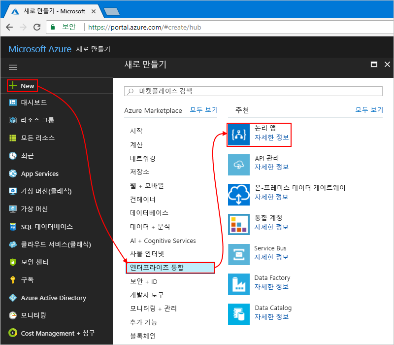
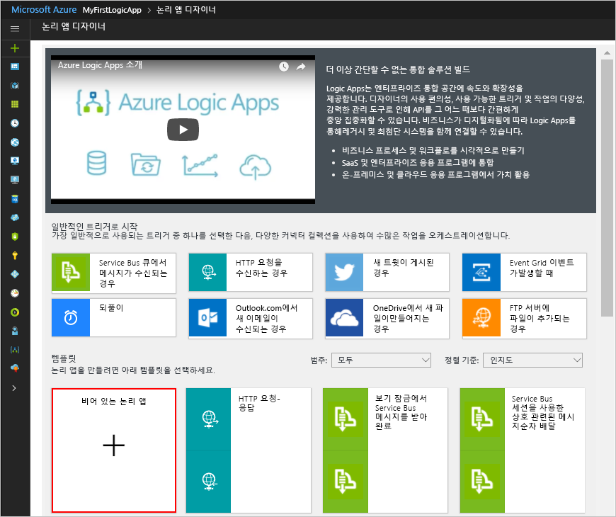

# <a name="manage-mailing-list-requests-with-a-logic-app"></a>논리 앱으로 메일 그룹 요청 관리

Azure Logic Apps를 사용하면 워크플로를 자동화하고 Azure 서비스, Microsoft 서비스, 기타 SaaS(software-as-a-service) 앱 및 온-프레미스 시스템의 데이터를 통합할 수 있습니다. 이 자습서에서는 [MailChimp](https://mailchimp.com/) 서비스를 통해 관리되는 메일 그룹에 대한 구독 요청을 처리하는 [논리 앱](../logic-apps/logic-apps-overview.md)을 만드는 방법을 보여줍니다.
이 논리 앱은 이러한 요청에 대한 이메일 계정을 모니터링하고, 이러한 승인 요청을 보내고, 승인된 구성원을 메일 그룹에 추가합니다.

이 자습서에서는 다음 방법에 대해 알아봅니다.

> [!div class="checklist"]
> * 빈 논리 앱을 만듭니다.
> * 구독 요청에 대한 이메일을 모니터링하는 트리거를 추가합니다.
> * 이러한 요청을 승인 또는 거부하는 이메일을 보내는 작업을 추가합니다.
> * 승인 응답을 확인하는 조건을 추가합니다.
> * 승인된 구성원을 메일 그룹에 추가하는 작업을 추가합니다.
> * 이러한 구성원이 목록에 성공적으로 조인되었는지 확인하는 조건을 추가합니다.
> * 이러한 구성원이 목록에 성공적으로 조인되었는지 확인하는 이메일을 보내는 작업을 추가합니다.

여기까지 모두 마치면 논리 앱이 이 워크플로와 비슷하게 보입니다.


Azure 구독이 아직 없는 경우 시작하기 전에 <a href="https://azure.microsoft.com/free/" target="_blank">Azure 체험 계정에 등록합니다</a>.

## <a name="prerequisites"></a>필수 조건

* MailChimp 계정. 논리 앱이 승인된 구성원에 대한 이메일 주소를 추가할 수 있는 "test-members-ML"이라는 목록을 만듭니다. 계정이 없는 경우 [무료 계정을 등록](https://login.mailchimp.com/signup/)하고 [목록을 만드는 방법](https://us17.admin.mailchimp.com/lists/#)을 알아보세요. 

* 승인 워크플로를 지원하는 이메일 계정과 Office 365 Outlook 또는 Outlook.com. 이 문서에서는 Office 365 Outlook을 사용합니다. 다른 이메일 계정을 사용하는 경우 일반적인 단계는 동일하지만 UI가 약간 다르게 표시될 수 있습니다.

## <a name="sign-in-to-the-azure-portal"></a>Azure Portal에 로그인합니다.

Azure 계정 자격 증명을 사용하여 <a href="https://portal.azure.com" target="_blank">Azure Portal</a>에 로그인합니다.

## <a name="create-your-logic-app"></a>논리 앱 만들기

1. Azure 주 메뉴에서 **리소스 만들기** > **엔터프라이즈 통합** > **논리 앱**을 선택합니다.

   

2. 그림에 설명된 대로 **논리 앱 만들기** 아래에서 논리 앱에 대한 정보를 제공합니다. 완료면 **대시보드에 고정** > **만들기**를 선택합니다.

   

   | 설정 | 값 | 설명 | 
   | ------- | ----- | ----------- | 
   | **Name** | LA-MailingList | 논리 앱의 이름 | 
   | **구독** | <*your-Azure-subscription-name*> | Azure 구독의 이름 | 
   | **리소스 그룹** | LA-MailingList-RG | 관련 리소스를 구성하는 데 사용된 [Azure 리소스 그룹](../azure-resource-manager/resource-group-overview.md)의 이름 | 
   | **위치**: | 미국 동부 2 | 논리 앱에 대한 정보를 저장할 지역 | 
   | **Log Analytics** | 꺼짐 | 진단 로깅에 대한 설정을 **끄기**로 유지합니다. | 
   |||| 

3. Azure가 앱을 배포한 후에 Logic Apps 디자이너가 열리고 일반적인 논리 앱 패턴에 대한 소개 비디오 및 템플릿이 포함된 페이지를 보여줍니다. **템플릿** 아래에서 **빈 Logic App**을 선택합니다.

   

다음으로, 구독 요청이 있는 수신 이메일을 수신 대기하는 [트리거](../logic-apps/logic-apps-overview.md#logic-app-concepts)를 추가합니다.
모든 논리 앱은 특정 이벤트가 발생하거나 새 데이터가 특정 조건을 충족할 때 실행되는 트리거를 통해 시작되어야 합니다. 자세한 내용은 [첫 번째 논리 앱 만들기](../logic-apps/quickstart-create-first-logic-app-workflow.md)를 참조하세요.

## <a name="add-trigger-to-monitor-emails"></a>이메일을 모니터링하는 트리거 추가

1. 디자이너에서 검색 상자에 "이메일이 도착하는 경우"를 입력합니다. 이메일 공급자에 대해 **<*해당-이메일-공급자*> - 새 이메일이 도착하는 경우** 트리거를 선택합니다.
   
   

   * Azure 회사 또는 학교 계정에서 Office 365 Outlook을 선택합니다.
   * Microsoft 개인 계정에서 Outlook.com을 선택합니다.

2. 자격 증명을 입력하라는 메시지가 나타나면 Logic Apps가 이메일 계정에 대한 연결을 만들 수 있도록 이메일 계정에 로그인합니다.

3. 이제 트리거가 모든 새 이메일에서 확인하는 조건을 지정합니다.

   1. 이메일 확인에 사용할 폴더, 간격 및 빈도를 지정합니다.

      

      | 설정 | 값 | 설명 | 
      | ------- | ----- | ----------- | 
      | **폴더** | 받은 편지함 | 모니터링할 이메일 폴더 | 
      | **간격** | 1 | 검사 간에 대기하는 간격의 수 | 
      | **Frequency(빈도)** | Hour | 검사 간 간격의 시간 단위  | 
      |  |  |  | 

   2. **고급 옵션 표시**를 선택합니다. **제목 필터** 상자에서, 트리거가 이메일 제목에서 검색할 텍스트로 ```subscribe-test-members-ML```을 입력합니다.

      

4. 트리거 세부 정보를 숨기려면 트리거의 제목 표시줄을 클릭합니다.

   

5. 논리 앱을 저장합니다. 디자이너 도구 모음에서 **저장**을 선택합니다.

   이제 논리 앱이 라이브 상태이지만 수신 이메일을 확인하는 것 외에는 아무 것도 수행하지 않습니다. 
   따라서 트리거가 실행되면 응답하는 작업을 추가해 보겠습니다.

## <a name="send-approval-email"></a>승인 전자 메일 보내기

트리거가 생겼으니, 요청을 승인 또는 거부하는 이메일을 보내는 [작업](../logic-apps/logic-apps-overview.md#logic-app-concepts)을 추가합니다. 

1. 트리거 아래에서 **+ 새 단계** > **작업 추가**를 선택합니다. "승인"을 검색하고 **<*해당-이메일-공급자*> - 승인 이메일 보내기** 작업을 선택합니다.

   

2. 설명된 것처럼 이 작업에 대한 정보를 제공합니다. 

   

   | 설정 | 값 | 설명 | 
   | ------- | ----- | ----------- | 
   | **To** | <*approver-email-address*> | 승인자의 이메일 주소입니다. 자신의 주소를 사용하여 테스트할 수 있습니다. | 
   | **사용자 옵션** | 승인, 거부 | 승인자가 선택할 수 있는 응답 옵션입니다. 기본적으로 승인자는 응답으로 "승인" 또는 "거부"를 선택할 수 있습니다. | 
   | **제목** | test-members-ML에 대한 구성원 요청 승인 | 설명이 포함된 이메일 제목 | 
   |  |  |  | 

   지금은 특정 편집 상자 내부를 클릭할 때 표시되는 동적 콘텐츠 목록 또는 인라인 매개 변수 목록을 무시합니다. 
   이 목록을 통해 워크플로에 입력으로 사용할 수 있는 이전 작업의 매개 변수를 선택할 수 있습니다. 
   브라우저 너비에 따라 표시되는 목록이 달라집니다. 
 
4. 논리 앱을 저장합니다.

다음으로, 승인자가 선택한 응답을 확인하는 조건을 추가합니다.

## <a name="check-approval-response"></a>승인 응답 확인

1. **승인 이메일 보내기** 작업에서 **+ 새 단계** > **조건 추가**를 선택합니다.

   워크플로에 입력으로 포함할 수 있는 매개 변수와 함께 조건 셰이프가 나타납니다. 

2. 보다 구체적인 설명이 포함되도록 조건 이름을 바꿉니다.

   1. 조건의 제목 표시줄에서 **줄임표**(**...** ) 단추 > **이름 바꾸기**를 선택합니다.

      예를 들어 브라우저가 좁은 보기인 경우:

      

      브라우저가 넓은 보기이고 동적 콘텐츠 목록이 줄임표 단추에 대한 액세스를 차단하는 경우 조건 내부에서 **동적 콘텐츠 추가**를 선택하여 목록을 닫습니다.

   2. ```If request approved``` 설명이 포함되도록 조건 이름을 바꿉니다.

3. 승인자가 **승인**을 선택했는지 확인하는 조건을 작성합니다.

   1. 조건 내부에서 왼쪽(와이드 브라우저 보기인 경우) 또는 위쪽(좁은 브라우저 보기인 경우)에 있는 **값 선택** 상자의 내부를 클릭합니다.
   매개 변수 목록 또는 동적 콘텐츠 목록의 **승인 이메일 보내기** 아래에서 **SelectedOption** 필드를 선택합니다.

      예를 들어 넓은 보기에서 작업하는 경우 조건이 이 예와 비슷하게 표시됩니다.

      

   2. 비교 연산자 상자에서 **다음과 같음** 연산자를 선택합니다.

   3. 오른쪽(와이드 보기인 경우) 또는 아래쪽(좁은 보기인 경우)에 있는 **값 선택** 상자에 ```Approve``` 값을 입력합니다.

      여기까지 마쳤으면 조건이 다음 예제와 비슷하게 표시됩니다.

      

4. 논리 앱을 저장합니다.

다음으로, 검토자가 요청을 승인할 때 논리 앱에서 수행하는 작업을 지정합니다. 

## <a name="add-member-to-mailchimp-list"></a>MailChimp 목록에 구성원 추가

이제 메일 그룹에 승인된 구성원을 추가하는 작업을 추가합니다.

1. 조건의 **true인 경우** 분기 내부에서 **작업 추가**를 선택합니다.
"mailchimp"를 검색하고 **MailChimp - 목록에 구성원 추가** 작업을 선택합니다.

   

3. MailChimp 계정에 로그인하라는 메시지가 표시되면 MailChimp 자격 증명으로 로그인합니다.

4. 여기에 설명된 것처럼 이 작업에 대한 정보를 제공합니다.

   

   | 설정 | 값 | 설명 | 
   | ------- | ----- | ----------- | 
   | **목록 Id** | test-members-ML | MailChimp 메일 그룹의 이름 | 
   | **상태** | subscribed | 새 구성원의 구독 상태입니다. 자세한 내용은 <a href="https://developer.mailchimp.com/documentation/mailchimp/guides/manage-subscribers-with-the-mailchimp-api/" target="_blank">MailChimp API로 구독자 관리</a>를 참조하세요. | 
   | **이메일 주소** | <*new-member-email-address*> | 매개 변수 목록 또는 동적 콘텐츠 목록의 **새 이메일이 도착하는 경우** 아래에서 새 구성원의 이메일 주소를 전달하는 **보내는 사람**을 선택합니다. 
   |  |  |  | 

5. 논리 앱을 저장합니다.

다음으로, 새 구성원이 메일 그룹에 성공적으로 조인했는지 확인할 수 있도록 조건을 추가합니다. 이렇게 하면 논리 앱에서 이 작업의 성공 또는 실패 여부를 알려줍니다.

## <a name="check-for-success-or-failure"></a>성공 또는 실패 여부 확인

1. **true인 경우** 분기의 **목록에 구성원 추가** 작업 아래에서 **자세히...** > **조건 추가**를 선택합니다.

2. ```If add member succeeded``` 설명이 포함되도록 조건 이름을 바꿉니다.

3. 승인된 구성원이 메일 그룹에 성공적으로 조인했는지 아니면 실패했는지 확인하는 조건을 작성합니다.

   1. 조건 내부에서 왼쪽(와이드 브라우저 보기인 경우) 또는 위쪽(좁은 브라우저 보기인 경우)에 있는 **값 선택** 상자의 내부를 클릭합니다.
   매개 변수 목록 또는 동적 콘텐츠 목록의 **목록에 구성원 추가** 아래에서 **상태** 필드를 선택합니다.

      예를 들어 넓은 보기에서 작업하는 경우 조건이 이 예와 비슷하게 표시됩니다.

      

   2. 비교 연산자 상자에서 **다음과 같음** 연산자를 선택합니다.

   3. 오른쪽(와이드 보기인 경우) 또는 아래쪽(좁은 보기인 경우)에 있는 **값 선택** 상자에 ```subscribed``` 값을 입력합니다.

   여기까지 마쳤으면 조건이 다음 예제와 비슷하게 표시됩니다.

   

다음으로, 승인된 구성원이 메일 그룹에 성공적으로 조인할 때 또는 조인에 실패할 때 보낼 이메일을 설정합니다.

## <a name="send-email-if-member-added"></a>구성원이 추가되면 이메일 보내기

1. **구성원 추가가 성공한 경우** 조건에 대한 **true인 경우** 분기에서 **작업 추가**를 선택합니다.

   

2. "outlook에서 이메일 보내기"를 검색하고 **<*해당-이메일-공급자*> - 이메일 보내기** 작업을 선택합니다.

   

3. ```Send email on success``` 설명이 포함되도록 작업 이름을 바꿉니다.

4. 설명된 것처럼 이 작업에 대한 정보를 제공합니다.

   

   | 설정 | 값 | 설명 | 
   | ------- | ----- | ----------- | 
   | **To** | <*your-email-address*> | 성공 이메일을 보낼 위치에 대한 이메일 주소입니다. 자신의 이메일 주소를 사용하여 테스트할 수 있습니다. | 
   | **제목** | <*subject-for-success-email*> | 성공 이메일의 제목입니다. 이 자습서에서는 매개 변수 목록 또는 동적 콘텐츠 목록의 **목록에 구성원 추가** 아래에서 이 텍스트를 입력하고 지정된 필드를 선택합니다. <p>"성공! 구성원이 'test-members-ML'에 추가됨: **이메일 주소**" | 
   | **본문** | <*body-for-success-email*> | 성공 이메일의 본문 콘텐츠입니다. 이 자습서에서는 매개 변수 목록 또는 동적 콘텐츠 목록의 **목록에 구성원 추가** 아래에서 이 텍스트를 입력하고 지정된 필드를 선택합니다.  <p>"새 구성원이 'test-members-ML'에 추가됨: **이메일 주소**"</br>"멤버 옵트인 상태: **상태**" | 
   | | | | 

5. 논리 앱을 저장합니다.

## <a name="send-email-if-member-not-added"></a>구성원이 추가되지 않으면 이메일 보내기

1. **구성원 추가가 성공한 경우** 조건에 대한 **false인 경우** 분기에서 **작업 추가**를 선택합니다.

   

2. "outlook에서 이메일 보내기"를 검색하고 **<*해당-이메일-공급자*> - 이메일 보내기** 작업을 선택합니다.

   

3. ```Send email on failure``` 설명이 포함되도록 작업 이름을 바꿉니다.

4. 여기에 설명된 것처럼 이 작업에 대한 정보를 제공합니다.

   

   | 설정 | 값 | 설명 | 
   | ------- | ----- | ----------- | 
   | **To** | <*your-email-address*> | 실패 이메일을 보낼 위치에 대한 이메일 주소입니다. 자신의 이메일 주소를 사용하여 테스트할 수 있습니다. | 
   | **제목** | <*subject-for-failure-email*> | 실패 이메일의 제목입니다. 이 자습서에서는 매개 변수 목록 또는 동적 콘텐츠 목록의 **목록에 구성원 추가** 아래에서 이 텍스트를 입력하고 지정된 필드를 선택합니다. <p>"실패. 구성원이 'test-members-ML'에 추가되지 않음: **이메일 주소**" | 
   | **본문** | <*body-for-failure-email*> | 실패 이메일의 본문 콘텐츠입니다. 이 자습서에서는 다음 텍스트를 입력합니다. <p>"구성원이 이미 존재하는 것일 수 있습니다. MailChimp 계정을 확인하세요." | 
   | | | | 

5. 논리 앱을 저장합니다. 

다음으로, 이 예제와 비슷하게 표시되는 논리 앱을 테스트합니다.

 

## <a name="run-your-logic-app"></a>논리 앱 실행

1. 메일 그룹에 조인하라는 이메일 요청을 자신에게 보냅니다.
받은 편지함에 요청이 나타날 때까지 기다립니다.

3. 수동으로 논리 앱을 실행하려면 디자이너 도구 모음에서 **실행**을 선택합니다. 

   이메일에 트리거의 제목 필터와 일치하는 제목이 있는 경우 논리 앱은 구독 요청을 승인하는 이메일을 보냅니다.

4. 승인 메일에서 **승인**을 선택합니다.

5. 구독자의 이메일 주소가 메일 그룹에 없는 경우 논리 앱은 해당 인물의 이메일 주소를 추가하고 사용자에게 다음 예제와 비슷한 이메일을 보냅니다.

   

   논리 앱이 구독자를 추가할 수 없으면 이 예제와 비슷한 이메일을 받게 됩니다.

   

   이메일을 받지 못한 경우 이메일의 정크 폴더를 확인합니다. 
   이메일 정크 필터가 이러한 종류의 메일을 리디렉션할 수 있습니다. 
   그렇지 않으면 논리 앱이 올바르게 실행되는지 모르는 경우 [논리 앱 문제 해결](../logic-apps/logic-apps-diagnosing-failures.md)을 참조하세요.

축하드립니다. Azure, Microsoft 서비스 및 기타 SaaS 앱의 정보를 통합하는 논리 앱을 만들고 실행하셨습니다.

## <a name="clean-up-resources"></a>리소스 정리

더 이상 필요 없으면 논리 앱 및 관련 리소스가 포함된 리소스 그룹을 삭제하세요. 주 Azure 메뉴에서 **리소스 그룹**으로 이동하여 논리 앱의 리소스 그룹을 선택합니다. **리소스 그룹 삭제**를 선택합니다. 리소스 그룹 이름을 입력하여 확인하고, **삭제**를 선택합니다.


## <a name="get-support"></a>지원 받기

* 질문이 있는 경우 [Azure Logic Apps 포럼](https://social.msdn.microsoft.com/Forums/en-US/home?forum=azurelogicapps)을 방문해 보세요.
* 기능 아이디어를 제출하거나 투표하려면 [Logic Apps 사용자 의견 사이트](http://aka.ms/logicapps-wish)를 방문하세요.

## <a name="next-steps"></a>다음 단계

이 자습서에서는 메일 그룹 요청에 대한 승인을 관리하는 논리 앱을 만들었습니다. 지금부터는 Azure Storage 및 Azure Functions 같은 Azure 서비스를 통합하여 이메일 첨부 파일을 처리하고 저장하는 논리 앱을 만드는 방법을 알아보겠습니다.

> [!div class="nextstepaction"]
> [이메일 첨부 파일 처리](../logic-apps/tutorial-process-email-attachments-workflow.md)