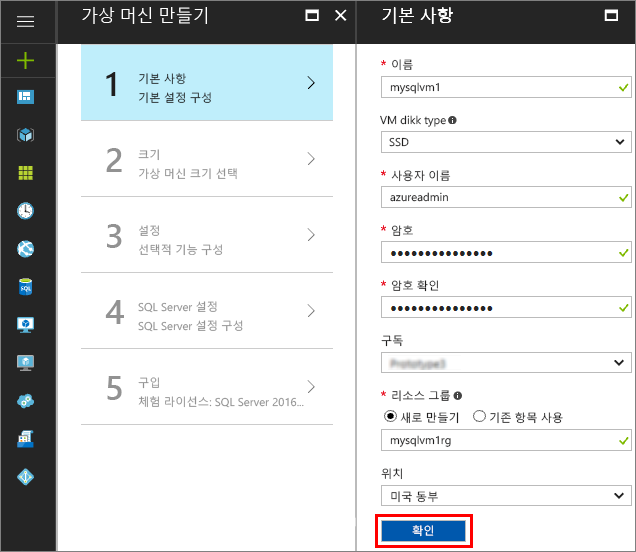
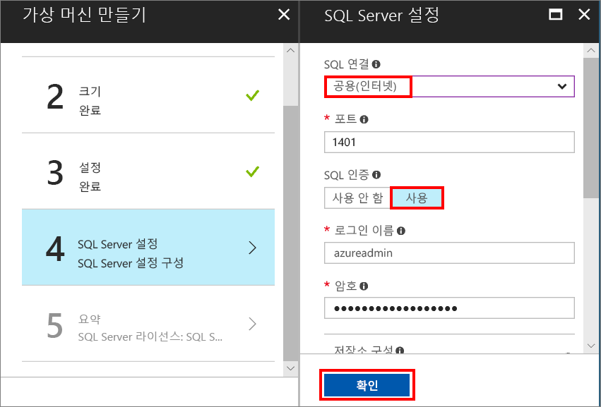
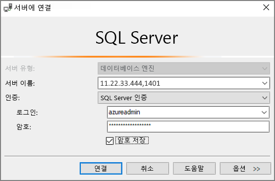

# 빠른 시작: Azure Portal에서 SQL Server 2017 Windows 가상 머신 만들기

> [!div class="op_single_selector"]
> * [Windows](quickstart-sql-vm-create-portal.md)
> * [Linux](../../linux/sql/provision-sql-server-linux-virtual-machine.md)

이 빠른 시작은 Azure Portal에서 SQL Server 가상 머신을 만드는 과정을 설명합니다.

> [!TIP]
> 이 빠른 시작에서는 신속하게 SQL VM을 프로비전하고 연결하는 경로를 제공합니다. 다른 SQL VM 프로비전 방법에 대한 자세한 내용은 [Azure Portal에서 Windows SQL Server VM에 대한 프로비전 가이드](virtual-machines-windows-portal-sql-server-provision.md)를 참조하세요.

> [!TIP]
> SQL Server 가상 머신에 대한 질문이 있으면 [질문과 대답](virtual-machines-windows-sql-server-iaas-faq.md)을 참조하세요.

##  Azure 구독 가져오기

Azure 구독이 아직 없는 경우 시작하기 전에 [체험 계정](https://azure.microsoft.com/free/?WT.mc_id=A261C142F)을 만듭니다.

## SQL Server VM 이미지 선택

1. 사용자 계정을 사용하여 [Azure Portal](https://portal.azure.com)에 로그인합니다.

1. Azure Portal에서 **리소스 만들기**를 클릭합니다. 

1. 검색 필드에 **Windows Server 2016의 SQL Server 2017 Developer**를 입력하고 ENTER 키를 누릅니다.

1. **체험용 SQL Server 라이선스: Windows Server 2016의 SQL Server 2017 Developer** 이미지를 선택합니다.

   

   > [!TIP]
   > Developer 버전은 개발 테스트 목적으로 무료로 제공되는 SQL Server의 모든 기능을 갖춘 버전이므로 이 자습서에서 사용됩니다. VM 실행 비용에 대해서만 비용을 지불합니다. 전체 가격 책정 고려 사항은 [SQL Server Azure VM에 대한 가격 책정 지침](virtual-machines-windows-sql-server-pricing-guidance.md)을 참조하세요.

1. **만들기**를 클릭합니다.

## 기본 세부 정보 제공

**기본** 창에서 다음 정보를 제공합니다.

1. **이름** 필드에서 고유한 가상 머신 이름을 입력합니다. 

1. **사용자 이름** 필드에서 VM의 로컬 관리자 계정에 대한 이름을 지정합니다.

1. 강력한 **암호**를 제공합니다.

1. 새 **리소스 그룹** 이름을 입력합니다. 이 그룹에서 가상 머신과 관련된 모든 리소스를 관리할 수 있습니다.

1. 다른 기본 설정을 확인하고 **확인**을 클릭하여 진행합니다.

   

## 가상 머신 크기 선택

1. **크기** 단계의 **크기 선택** 창에서 가상 머신 크기를 선택합니다.

   이 빠른 시작의 경우 **D2S_V3**를 선택합니다. 포털에서는 연속 사용에 예상된 월별 컴퓨터 비용을 보여줍니다(SQL Server 라이선스 비용을 포함하지 않음). Developer Edition에는 SQL Server에 대한 추가 라이선스 비용이 없습니다. 특정 가격 책정에 대한 자세한 내용은 [가격 책정 페이지](https://azure.microsoft.com/pricing/details/virtual-machines/windows/)를 참조하세요.

   > [!TIP]
   > **D2S_V3**는 컴퓨터 크기는 테스트 중에 요금을 절약합니다. 하지만 프로덕션 워크로드의 경우 [Azure Virtual Machines의 SQL Server에 대한 성능 모범 사례](virtual-machines-windows-sql-performance.md)에서 권장하는 컴퓨터 크기 및 구성을 참조하세요.

1. **선택**을 클릭하여 계속합니다.

## 선택적 기능 구성

1. VM에 원격 데스크톱 연결을 사용하려면 **설정** 창의 **공용 인바운드 포트 선택** 목록에서 **RDP(3389)** 포트를 선택합니다.

   

   > [!NOTE]
   > **MS SQL(1433)** 포트를 선택하여 SQL Server에 원격으로 액세스할 수 있습니다. 그러나 **SQL Server 설정** 단계에서도 이 옵션을 제공하므로 꼭 이렇게 할 필요는 없습니다. 이 단계에서 1433 포트를 선택하면 **SQL Server 설정** 단계에서 무엇을 선택하든 이 포트가 열립니다.

1. **확인**을 클릭하여 변경 내용을 저장하고 계속 진행합니다.

## SQL 서버 설정

**SQL Server 설정** 창에서 다음 옵션을 구성합니다.

1. **SQL 연결** 드롭다운 목록에서 **공용(인터넷)** 을 선택합니다. 그러면 인터넷을 통해 SQL Server 연결을 허용합니다.

1. **포트**를 **1401**로 변경하여 공용 시나리오에서 잘 알려진 포트 이름을 사용하지 않습니다.

1. **SQL 인증** 아래에서 **사용**을 클릭합니다. SQL 로그인은 VM에 구성한 동일한 사용자 이름 및 암호로 설정됩니다.

1. 필요한 경우 다른 설정을 변경하고 **확인**을 클릭하여 SQL Server VM의 구성을 완료합니다.

   

## SQL Server VM 만들기

**요약** 창에서 요약을 검토하고 **구매**를 클릭하여 이 VM에 대해 지정된 SQL Server, 리소스 그룹 및 리소스를 만듭니다.

Azure Portal에서 배포를 모니터링할 수 있습니다. 화면 맨 위에 있는 **알림** 단추는 배포의 기본 상태를 표시합니다.

> [!TIP]
> Windows SQL Server VM을 배포하는 데 몇 분 정도가 걸릴 수 있습니다.

## SQL Server에 연결

1. 포털에 있는 가상 머신 속성의 **개요** 섹션에서 VM의 **공용 IP 주소**를 찾습니다.

1. 인터넷에 연결된 다른 컴퓨터에서 SSMS(SQL Server Management Studio)를 엽니다.

   > [!TIP]
   > SQL Server Management Studio가 없는 경우 [여기](https://docs.microsoft.com/sql/ssms/download-sql-server-management-studio-ssms)에서 다운로드할 수 있습니다.

1. **서버에 연결** 또는 **데이터베이스 엔진에 연결** 대화 상자에서 **서버 이름** 값을 편집합니다. VM의 공용 IP 주소를 입력합니다. 그런 다음 쉼표를 추가하고 새 VM을 구성할 때 지정한 사용자 지정 포트 **1401**을 추가합니다. 예: `11.22.33.444,1401`

1. **인증** 상자에 **SQL Server 인증**을 선택합니다.

1. **로그인** 상자에 올바른 SQL 로그인 이름을 입력합니다.

1. **암호** 상자에 로그인 암호를 입력합니다.

1. **Connect**를 클릭합니다.

    

## VM에 원격으로 로그인

다음 단계를 사용하여 원격 데스크톱으로 SQL Server 가상 머신에 연결합니다.

[!INCLUDE [Connect to SQL Server VM with remote desktop](../../../../includes/virtual-machines-sql-server-remote-desktop-connect.md)]

SQL Server 가상 머신에 연결된 후에, SQL Server Management Studio를 시작하고 로컬 관리자 자격 증명을 사용하여 Windows 인증으로 연결할 수 있습니다. SQL Server 인증을 사용하도록 설정한 경우에는, 프로비전 중에 구성해 놓은 SQL 로그인 및 암호를 사용하여 SQL 인증에 연결할 수 있습니다.

컴퓨터에 연결하면 요구 사항에 따라 컴퓨터와 SQL Server 설정을 직접 변경할 수 있습니다. 예를 들어, 방화벽 설정을 구성하거나 SQL Server 구성 설정을 변경할 수 있습니다.

## 리소스 정리

계속해서 SQL VM을 실행하지 않아도 되는 경우 사용 중이 아닌 VM을 중지하여 불필요한 요금을 방지할 수 있습니다. 포털에서 관련된 리소스 그룹을 삭제하여 가상 머신과 관련된 모든 리소스를 영구적으로 삭제할 수 있습니다. 그러면 가상 머신을 영구적으로 삭제하므로 주의하여 이 명령을 사용합니다. 자세한 내용은 [포털을 통한 Azure 리소스 관리](../../../azure-resource-manager/resource-group-portal.md)를 참조하세요.

## 다음 단계

이 빠른 시작에서는 Azure Portal에서 SQL Server 2017 가상 머신을 만들었습니다. 새 SQL server 데이터를 마이그레이션하는 방법에 대한 자세한 내용은 다음 문서를 참조하세요.

> [!div class="nextstepaction"]
> [SQL VM에 데이터베이스 마이그레이션](virtual-machines-windows-migrate-sql.md)
