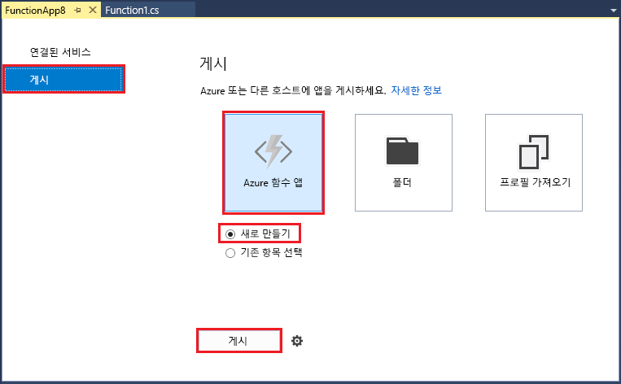
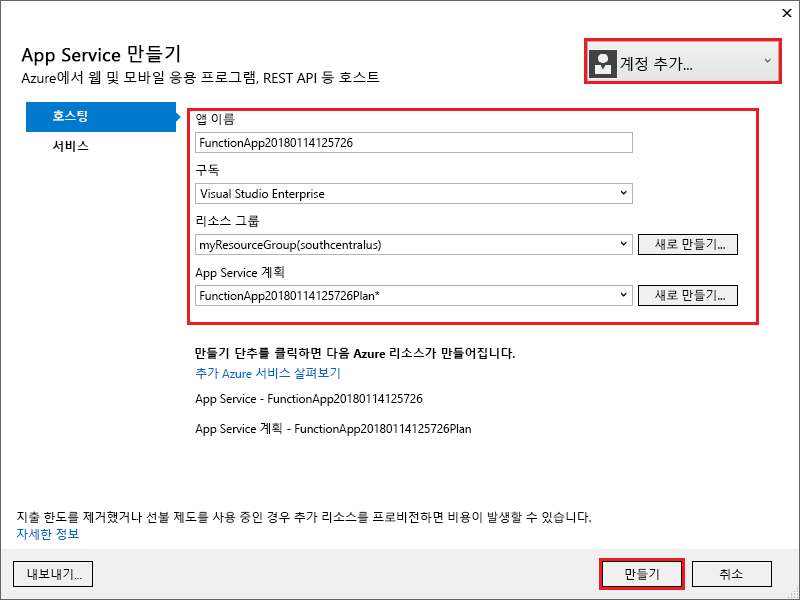
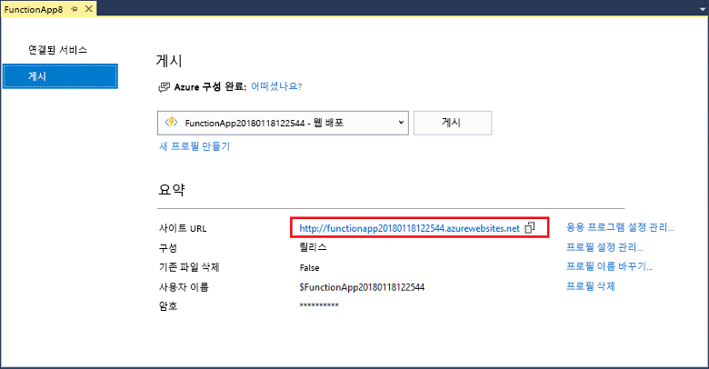

1. **솔루션 탐색기**에서 프로젝트를 마우스 오른쪽 단추로 클릭하고 **게시**를 선택합니다. **새로 만들기**를 선택한 다음 **게시**를 선택합니다. 

    

2. Visual Studio를 Azure 계정에 아직 연결하지 않았으면 **계정 추가...**를 선택합니다.  

3. **App Service 만들기** 대화 상자에서 다음 표에 지정된 대로 **호스팅** 설정을 사용합니다. 

    

    | 설정      | 제안 값  | 설명                                |
    | ------------ |  ------- | -------------------------------------------------- |
    | **앱 이름** | 전역적으로 고유한 이름 | 새 함수 앱을 고유하게 식별하는 이름입니다. |
    | **구독** | 구독 선택 | 사용할 Azure 구독입니다. |
    | **[리소스 그룹](../articles/azure-resource-manager/resource-group-overview.md)** | myResourceGroup |  함수 앱을 만들 리소스 그룹의 이름입니다. **새로 만들기**를 선택하여 새 리소스 그룹을 만듭니다.|
    | **[App Service 계획](../articles/azure-functions/functions-scale.md)** | 소비 계획 | **새로 만들기**를 클릭하여 새 계획을 만들 때 **크기** 아래에서 **소비**를 선택해야 합니다. 또한 사용자 근처 또는 함수가 액세스할 기타 서비스에 가까운 [지역](https://azure.microsoft.com/regions/)의 **위치**를 선택합니다.  |

    >[!NOTE]
    >Functions 런타임에는 Azure Storage 계정이 필요합니다. 이로 인해 함수 앱을 만들 때 새 Azure Storage 계정이 생성됩니다.

4. **만들기**를 클릭하여 이러한 설정으로 Azure에서 함수 앱 및 관련 리소스를 만들고 함수 프로젝트 코드를 배포합니다. 

5. 베포가 완료된 후에 Azure에서 함수 앱의 주소인 **사이트 URL** 값을 기록해 둡니다.

    
